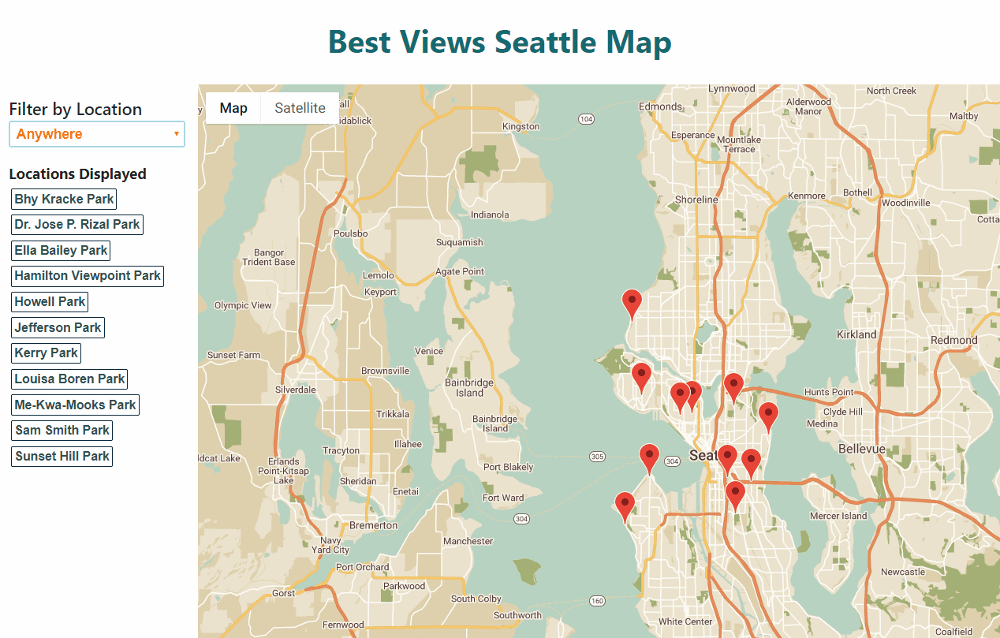
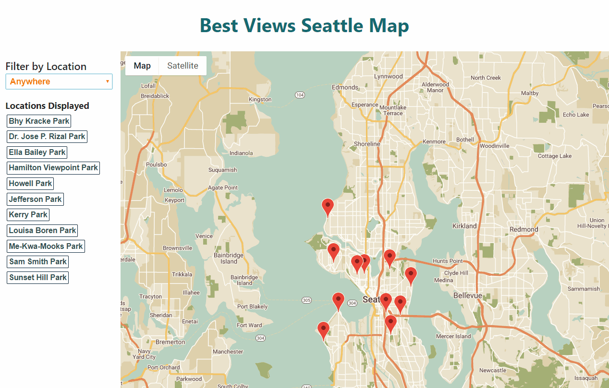
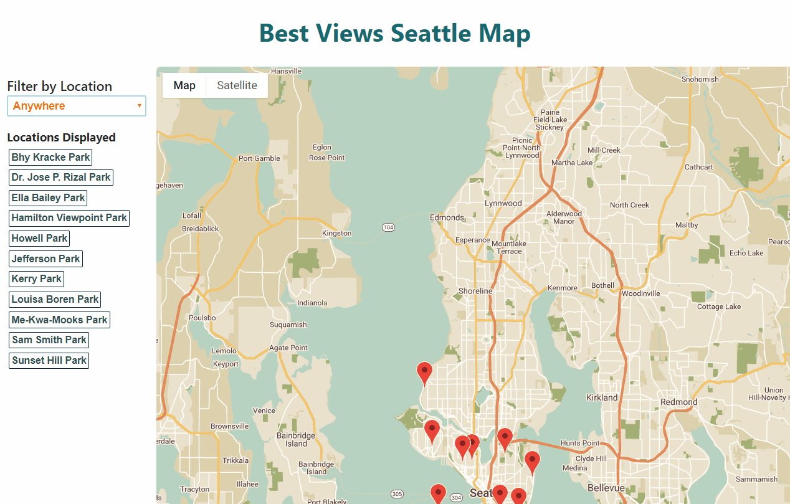
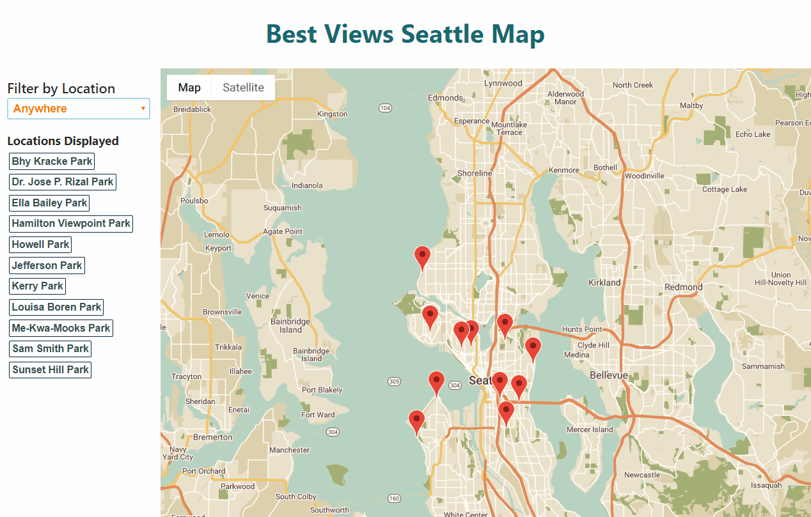

# Neighborhoods Map | Udacity FEND | 2018

Project seven of seven for Udacity's Front End Web Developer Nanodegree; completed as part of the Grow with Google Scholarship program, 2018.

The goal of this project was to practice building a single page web application using the React JavaScript library while utilizing the Google Maps API along with a third-party API for fetching data about specific locations on the map. The project also required students to implement accesiblity features and responsive design.

## Authors

I — Jacob W. Olson — built this app from scratch based on knowledge and skills gained through Udacity's Front End Web Developer course supplemented by the wealth of reasources available on the web, and by utilizing knowledge and techniques from various particular sources noted throughout the code and discussed below.

In addition to the cited sources and Udacity's Front End Web Developer Nanodegree program, there is no way I could have completed this project without the support and encouragement of my fellow Grow with Google scholars and the wider programming community, all along my path of learning and in my work on this particular project as well. 

As I take this last step in my Grow with Google experience with Udacity, I feel I have very real momentum and a new passion, and that I am only at the start of my learning journey in tech. And I know I am going forward alongside a cohort of talented and driven scholars moving towards futures and a future that we have the power -- and that we are being empowered -- to help shape for the better.

## Getting the App Up and Running

1. Create a local directory on your machine and clone the repository to it. For help with this step, see [this tutorial from GitHub](https://help.github.com/articles/cloning-a-repository/ "GitHub Help — Clone a Repository").

2. Make sure you have node.js and npm installed. 
    * To check for node.js, open a command window and enter "node -v" in the command line. If node is installed, a version number should be returned: e.g., "v8.11.3." 
    * To check for npm, enter "npm -v." If npm is installed, you should likewise see a version number returned: e.g., "6.4.1."
    * If you do not have node and npm installed, you may wish follow [these instructions from Dave McFarland at Treehouse](https://blog.teamtreehouse.com/install-node-js-npm-windows "'How to Install Node.js® and NPM on Windows' by Dave McFarland") to get them going on your machine.
    * To learn more about node.js and npm, you may wish to check out the linked article from Treehouse above, see [this article by Priyash Patel on freeCodeCamp's blog](https://medium.freecodecamp.org/what-exactly-is-node-js-ae36e97449f5 "'What exactly is Node.js?' by Priyesh Patel"), take a look around [the node.js website](https://node.js.org/en/ "Node.js website") or at any other of the many awesome resources for learning out there. 

3. With node.js and npm installed, you'll next want to install the application's dependencies. 
    * Run `npm install` on the command line, and wait for the installation process to complete.

4. Next, fire up the development server.
    * Enter `npm start` on the command line. After a short time, a browser window with the URL "https:localhost:3000" should open, displaying the app. You can navigate to this URL as well.

5. You should now be able to check out the app and it's features!
  

## Check out the App

- Click on map markers to see details about each viewpoint, including an asynchronously fetched image associated with the location from Flickr, a link to the account that uploaded the image, and a link to the Seattle Parks and Recreation page for the location.

    

- You can also click on location names as they appear in the list below the filter to display the info window for the marker associated with the place name.

- Use the filter to select viewpoints by their position relative to Cal Anderson Park in Seattle's Capitol Hill neighborhood.

    

- To check out some of the error handling built in to this application: 

    - Disconnect from the internet and refresh the page: a custom error message made possible by [a custom loading container provided by google-maps-react](https://github.com/fullstackreact/google-maps-react/blob/master/README.md#automatically-lazy-loading-google-api), and as overviewed by Doug Brown in his walkthrough, will appear if the map does not load after two seconds.

    

    - After you reconnect from the internet, go in to `LocationsDisplay.js` and "break" the FLIKR_API_KEY constant -- for example, by adding a space in the string of numbers and letters -- or temporarily change something else that will cause the FETCH request to the Flickr API to fail. Then click on a marker:
    a custom alert message will appear with the message that the app was not able to retrieve an image from Flickr for the location at the moment, and then the info window for the marker should appear as normal, but with a message box again informing about the failure to retrieve an image where an image itself would otherwise appear. Feel free to dig in to the code to see how this works!

    

- This app was built with accessibility and responsive design in mind. You should be able to use the app on screens of all sizes. Moreover, you should be able to easily tab through the page and access elements using a keyboard or other assistive technologies and folks using screen readers should be able to readily navigate the DOM, which is organized with semantic markup and ARIA attributes. If you are interested in learning more about Accessibility Rich Internet Applications, you might find [this article] (https://developer.mozilla.org/en-US/docs/Web/Accessibility/An_overview_of_accessible_web_applications_and_widgets) instructive. You can view the WAI-ARIA specification in full [here](https://www.w3.org/TR/wai-aria-1.1/).

## Dependencies

- [creat-react-app](https://github.com/facebook/create-react-app)
- [google-maps-react](https://github.com/fullstackreact/google-maps-react)
- [sort-by](https://www.npmjs.com/package/sort-by)

## About the Service Worker

The service worker for this app came baked-in courtesy of create-react-app and is flipped to `.register()` in `index.js`. Following the instructions above, however, you will be looking at the app in developer mode, which means the service worker will not be actively providing offline functionality. 

If this app were running in production mode the service worker would be in action helping the app run as many features as possible when internet connectivity is not available.

To learn more about service workers you may wish to read [this introduction] (https://developers.google.com/web/ilt/pwa/introduction-to-service-worker) on the Google Developers website.

## Sources 

Udacity's Front End Web Developer Nanodegree program, 2018, was an immense source of knowledge and skills which I used to complete this project. Feedback from a Udacity reviewer on the first iteration of this project was also incorporated in to the current version.

Project coach Doug Brown's walkthrough was a particularly instructive resource for me in the completion of this project. Furthermore, as general overviews and outlines for creating a single page application with React incorporating Google Maps, articles by [Rachel Njeri](https://scotch.io/tutorials/react-apps-with-the-google-maps-api-and-google-maps-react) and [by Ari Lerner](https://www.fullstackreact.com/articles/how-to-write-a-google-maps-react-component/), as referenced in `LocationsDisplay.js`, were of great value and use. 

Sources for this application are cited throughout the files, as close to relevant pieces of code as possible, and app-wide sources are also discussed at the top of `App.js`. 

#### List of sources cited:

- https://www.youtube.com/watch?v=NVAVLCJwAAo&feature=youtu.be
- https://scotch.io/tutorials/react-apps-with-the-google-maps-api-and-google-maps-react
- https://www.fullstackreact.com/articles/how-to-write-a-google-maps-react-component/
- https://stackoverflow.com/a/43938322.
- https://stackoverflow.com/a/47563854
- https://reactjs.org/docs/lifting-state-up.html#lifting-state-up
- https://reactjs.org/docs/components-and-props.html
- https://developer.mozilla.org/en-US/docs/Web/JavaScript/Reference/Operators/Conditional_Operator
- https://stackoverflow.com/a/16436975
- https://stackoverflow.com/a/14853974
- https://www.flickr.com/services/api/response.rest.html
- https://www.flickr.com/services/api/flickr.galleries.getPhotos.html
- https://www.flickr.com/services/api/misc.urls.html
- http://code.flickr.net/2008/08/19/standard-photos-response-apis-for-civilized-age/
- http://kylerush.net/blog/flickr-api/
- https://developer.mozilla.org/en-US/docs/Web/JavaScript/Reference/Global_objects/Function/bind
- https://teamtreehouse.com/community/how-do-i-get-flickr-to-respond-json-that-i-can-use
- https://www.flickr.com/services/api/flickr.photos.search.html
- https://www.flickr.com/services/api/misc.urls.html
- https://dmitripavlutin.com/object-rest-spread-properties-javascript/
- https://stackoverflow.com/a/51785817
- https://stackoverflow.com/a/36396843
- https://stackoverflow.com/a/49015889
- https://mapstyle.withgoogle.com/
- http://vaidehijoshi.github.io/blog/2015/01/06/the-final-countdown-using-javascripts-setinterval-plus-clearinterval-methods/
- https://github.com/dbilgili/Custom-ReactJS-Dropdown-Components
- https://www.w3.org/TR/wai-aria-practices/examples/listbox/listbox-collapsible.html
- https://www.w3schools.com/tags/tag_select.asp
- https://developer.mozilla.org/en-US/docs/Web/HTML/Element/select
- https://github.com/w3c/aria-practices/issues/515
- https://stackoverflow.com/a/7231215
- https://stackoverflow.com/a/28329640
- https://color.adobe.com/soft-orange-color-theme-49345/
- https://stackoverflow.com/a/1027367
- https://css-tricks.com/snippets/css/a-guide-to-flexbox/
- https://color.adobe.com/gold-color-scheme-burnt-orange-color-palette-color-theme-9841276/
- https://www.w3.org/Style/Examples/007/center.en.html 

## Information Included by create-react-app with this Build:

            This project was bootstrapped with [Create React App](https://github.com/facebook/create-react-app).

            ## Available Scripts

            In the project directory, you can run:

            ### `npm start`

            Runs the app in the development mode. 
            Open [http://localhost:3000](http://localhost:3000) to view it in the browser.

            The page will reload if you make edits. 
            You will also see any lint errors in the console.

            ### `npm test`

            Launches the test runner in the interactive watch mode. 
            See the section about [running tests](https://facebook.github.io/create-react-app/docs/running-tests) for more information.

            ### `npm run build`

            Builds the app for production to the `build` folder. 
            It correctly bundles React in production mode and optimizes the build for the best performance.

            The build is minified and the filenames include the hashes. 
            Your app is ready to be deployed!

            See the section about [deployment](https://facebook.github.io/create-react-app/docs/deployment) for more information.

            ### `npm run eject`

            **Note: this is a one-way operation. Once you `eject`, you can’t go back!**

            If you aren’t satisfied with the build tool and configuration choices, you can `eject` at any time. This command will remove the single build dependency from your project.

            Instead, it will copy all the configuration files and the transitive dependencies (Webpack, Babel, ESLint, etc) right into your project so you have full control over them. All of the commands except `eject` will still work, but they will point to the copied scripts so you can tweak them. At this point you’re on your own.

            You don’t have to ever use `eject`. The curated feature set is suitable for small and middle deployments, and you shouldn’t feel obligated to use this feature. However we understand that this tool wouldn’t be useful if you couldn’t customize it when you are ready for it.

            ## Learn More

            You can learn more in the [Create React App documentation](https://facebook.github.io/create-react-app/docs/getting-started).

            To learn React, check out the [React documentation](https://reactjs.org/).

Thanks for checking out my project! I hope you enjoyed it.

As always, comments, feedback, suggestions and requests for collaboration are most welcome. 

        - Jacob W. Olson

